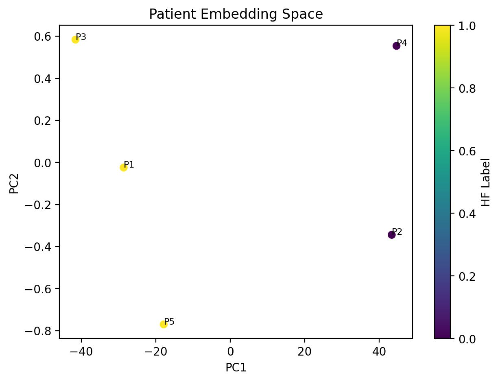

# Patient2Vec
Learning Multimodal Patient Representations from Omics Data- this is a lightweight framework demonstrating how heterogeneous biomedical measurements (genomics, transcriptomics, clinical traits) can be tensorized and embedded into a unified patient representation.


> ⚠️ **Work in Progress** — This repository is actively under development and not yet ready for production use. Code, documentation, and examples are being added incrementally. Watch or star the repo to follow along!


# Motivation

Modern biomedical datasets measure patients across many modalities (genomics, transcriptomics, imaging, clinical traits). A central challenge in AI for biomedicine is learning unified representations across these heterogeneous measurements.

This repository demonstrates a lightweight framework for tensorizing multimodal biological data and learning patient embeddings using neural networks.

# Key Concepts

Multimodal Data Integration:
Combining heterogeneous biological measurements into a unified data structure.

Biological Data Tensorization:
Converting genomics, transcriptomics, and phenotypic data into machine-learning ready tensors.

Representation Learning:
Learning latent embeddings that capture biological variation and disease signals.

Patient Embeddings:
Low-dimensional representations of patients that enable clustering, similarity analysis, and predictive modeling.


# Example Workflow
Genomics + RNA-seq + Clinical Traits

        ↓

Data Tensorization

        ↓

Multimodal Neural Network

        ↓

Patient Embedding Space

        ↓

Patient Similarity & Disease Clustering


# Example analysis:

Patients with high NPPA expression cluster with HF phenotypes - As a demonstration, the framework explores how expression patterns in cardiac-associated genes such as NPPA can influence patient clustering.
In the synthetic dataset included in this repository, patients with elevated NPPA and NPPB expression, combined with adverse clinical characteristics such as increased BMI and blood pressure, cluster together in embedding space.

This demonstrates how multimodal embeddings can capture biologically meaningful disease patterns.


## 📁 Repository Structure

```
patient2vec
│
├── README.md
├── environment.yml
│
├── data
│   ├── sample_genomics.csv
│   ├── sample_expression.csv
│   └── sample_clinical.csv
│
├── notebooks
│   └── patient2vec_demo.ipynb
│
├── src
│   ├── preprocessing.py
│   ├── tensorization.py
│   ├── model.py
│   └── visualization.py
│
├── figures
│   └── patient_embeddings.png
│
├── generate_synthetic_data.py
└── run_demo.py


```


# Quick Start
##  1 Install environment
conda env create -f environment.yml
conda activate patient2vec

OR
pip install torch pandas scikit-learn matplotlib

##  2 Run the demo

python generate_synthetic_data.py
python run_demo.py

Output : figures/patient_embeddings.png


notebooks/01_data_tensorization.ipynb

This notebook demonstrates:

1. preprocessing heterogeneous biological data

2. tensorizing multimodal measurements

##  3 Train embedding model

notebooks/02_multimodal_embedding.ipynb

##  4 Explore patient similarity

notebooks/03_patient_similarity_analysis.ipynb

## Example Embedding Space

Patient embeddings learned from multimodal biological data.




## Future Extensions

Potential directions include:

        integration of single-cell transcriptomics

        inclusion of EHR and longitudinal clinical data

        transformer architectures for multimodal representation learning

        foundation-model style embeddings for biomedical data


## Contributing

Contributions are welcome! If you find a bug, have a feature request, or want to contribute code:

1. Fork the repository
2. Create a new branch (`git checkout -b feature/your-feature`)
3. Commit your changes (`git commit -m 'Add your feature'`)
4. Push to the branch (`git push origin feature/your-feature`)
5. Open a Pull Request

---

## Contact

**Lakshmi Kuttippurathu, PhD**
- 🔗 [LinkedIn](https://www.linkedin.com/in/lakshmikc/)


---

*Built with ❤️ for the open-science community. If this tool helps your research, please consider starring the repository ⭐*


